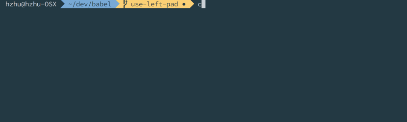
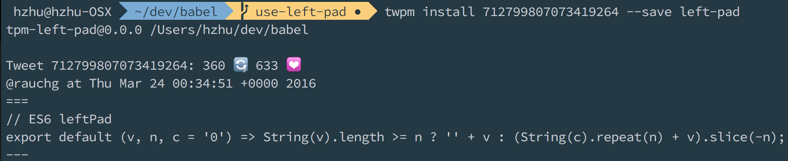

twpm
====

twitter package manager

>https://gist.github.com/rauchg/5b032c2c2166e4e36713#gistcomment-1732501

[](https://twitter.com/rauchg/status/712799807073419264)

### Simple Usage

```bash
// after adding `./twitter-config.js` ^
twpm install 712799807073419264 --save left-pad
// in a file, require it with the prefix
const leftPad = require("@twpm/left-pad");

// search
twpm search left-pad
// use the id you get to install it
twpm install 715856513777147900 --save left-pad
```

### Setup


You need to add a CONSUMER_KEY and CONSUMER_KEY environment variables
or you will need a `twitter-config.js` in the root repo you run this in.

> You can create a twitter app at https://apps.twitter.com to get these 2 keys

```js
// twitter-config.js
module.exports = {
  "consumer_key": "",
  "consumer_secret": "",
  "app_only_auth": true

  // not necessary unless we plan to post tweets as well
  // "access_token": "",
  // "access_token_secret": ""
};
```

> TODO: is support without using a key possible?

### Commands

```bash
# install specific tweet/id
twpm install 712799807073419264 # tweet id
twpm install https://twitter.com/rauchg/status/712799807073419264 # full url
# Will install to node_modules/@twpm/712799807073419264

`install` creates a `index.js` with transpiled source and a `package.json` with metadata (including the original source).

# save to package.json
# under the twpm key
twpm install 712799807073419264 --save left-pad
# Will install to node_modules/@twpm/left-pad

# install everything under the `twpm.dependencies`
twpm install
# shorthand
twpm i
```

### Require

> The default package folder/require prefix is `@twpm/`

```js
// usage for `twpm install 712799807073419264 --save left-pad`
const leftPad = require("@twpm/left-pad");
leftPad(1, 5) // "00001"
```

### The tweets

Since twpm will be transpiling the code, twpm will strip out the first line if the tweet is multiline and contains the hashtag `#twpm`.

```js
// Input
@_henryzhu //#twpm:left-pad
export default (v, n, c = '0') => String(v).length >= n ? '' + v : (String(c).repeat(n) + v).slice(-n);
// Input to be transpiled (just the function. otherwise an error will occur with decorators)
export default (v, n, c = '0') => String(v).length >= n ? '' + v : (String(c).repeat(n) + v).slice(-n);
```

Currently you will need to use a `export default function() {}` or `export default () => {}` in your tweet.

> TODO: support any binding.

### Search

You can search through tweets that are hashtagged with `#twpm` and install them

> TODO: prompt to install afterwards

```js
# get some random ones
twpm search
# specific keyword search
twpm search left-pad
```


### Repo `package.json`

```js
{
  "name": "pad",
  "twpm": {
    "modulesLocation": "node_modules", // default folder
    "folderPrefix": "@twpm/", // default prefix
    "packageMetadata": [
      "name",
      "text",
      "screen_name",
      "id_str",
      "retweet_count",
      "favorite_count",
      "created_at",
      "user"
    ] // default fields to take from twitter status
    "dependencies": {
      "@twpm/left-pad": "712799807073419264"
      "@twpm/sort": "713782217646931968"
    }
  }
}
```

### Example



```bash
# twpm i 712799807073419264 --save asdf
twpm-asdf@0.0.0 /Users/hzoo/twpm-test

Tweet 712799807073419264: 359 🔄, 632 💟
@rauchg at Thu Mar 24 00:34:51 +0000 2016
===
// ES6 leftPad
export default (v, n, c = '0') => String(v).length >= n ? '' + v : (String(c).repeat(n) + v).slice(-n);
---
```

```
- twpm-test
  - node_modules
    - @twpm
      - asdf
        - index.js # transpiled index.js
        - package.json # reformatted twitter data + name field
```

## Test

> You will need `twitter-config.js` setup or environment variables

```bash
npm i
twpm i
npm t
```
